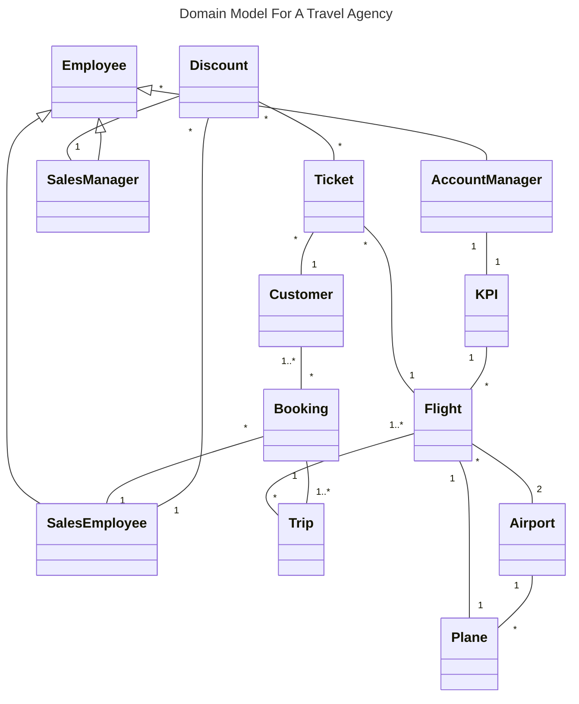

```mermaid
---
title: Domain Model For A Travel Agency
---
classDiagram

    Discount "*" -- "*" Ticket
    Discount "*" -- "1" Sales Manager
    SalesEmployee "1" -- "*" Discount

    Ticket "*" -- "1" Customer
    Ticket "*" -- "1" Flight
    Customer "1..*" -- "*" Booking

    Flight "1..*" -- "*" Trip
    Flight "*" -- "2" Airport
    Flight "1" -- "1" Plane
    KPI "1" -- "*" Flight

    Employee<|--SalesEmployee
    Employee<|--SalesManager
    Employee<|--AccountManager

    Booking "*" -- "1" SalesEmployee
    Booking "1" -- "1..*" Trip

    Airport "1" -- "*" Plane
    
    AccountManager "1" -- "1" KPI

    class Discount{
    }
    class Ticket{
    }
    class Booking{
    }
    class Trip{
    }
    class Employee{
    }
    class Flight{
    }
    class Customer{
    }
    class Airport{
    }
    class Plane{
    }
    class SalesEmployee{
    }
    class SalesManager{
    }
    class AccountManager{
    }
    class KPI {
    }
```