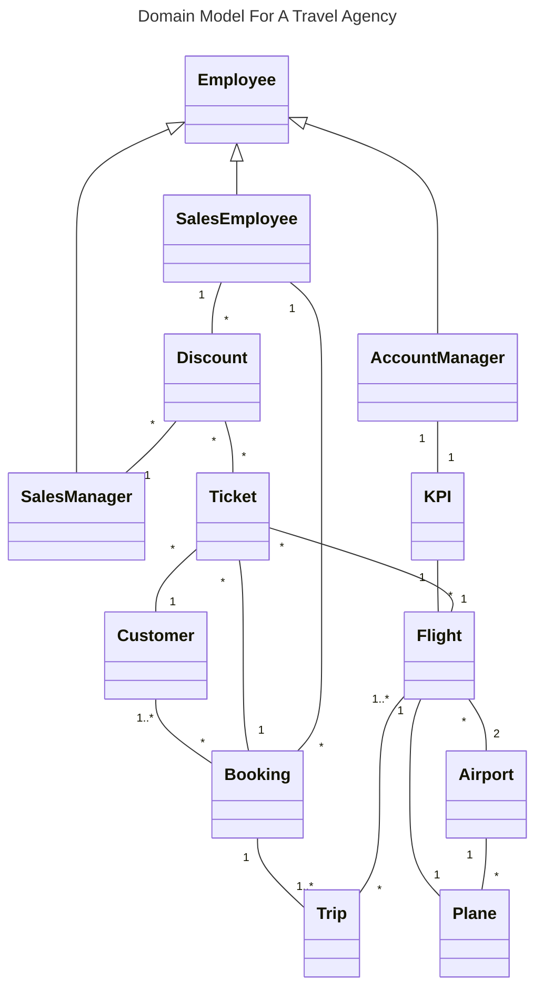

```mermaid
---
title: Domain Model For A Travel Agency
---
classDiagram

    class Employee {
    }
    class SalesEmployee {
    }
    class SalesManager {
    }
    class AccountManager {
    }
    class KPI {
    }
    class Discount {
    }
    class Ticket {
    }
    class Booking {
    }
    class Trip {
    }
    class Flight {
    }
    class Customer {
    }
    class Airport {
    }
    class Plane {
    }

    %% Employee Hierarchy
    Employee <|-- SalesEmployee
    Employee <|-- SalesManager
    Employee <|-- AccountManager

    %% KPI and Account Management
    AccountManager "1" -- "1" KPI
    KPI "1" -- "*" Flight

    %% Booking & Ticketing
    Customer "1..*" -- "*" Booking
    Booking "1" -- "*" Ticket
    Booking "*" -- "1" SalesEmployee
    Booking "1" -- "1..*" Trip
    Ticket "*" -- "1" Flight
    Ticket "*" -- "1" Customer

    %% Discounts
    Discount "*" -- "*" Ticket
    Discount "*" -- "1" SalesManager
    SalesEmployee "1" -- "*" Discount

    %% Flights & Trips
    Flight "1..*" -- "*" Trip
    Flight "*" -- "2" Airport
    Flight "1" -- "1" Plane
    Airport "1" -- "*" Plane

```