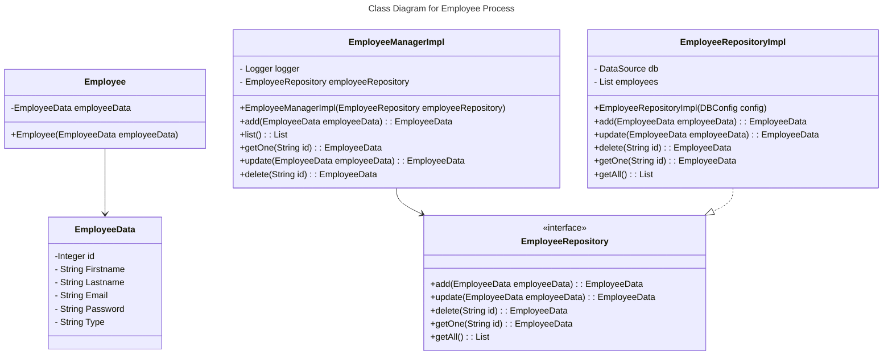

```mermaid
---
title: Class Diagram for Employee Process
---
classDiagram

    class EmployeeData {
        -Integer id
        - String Firstname
        - String Lastname
        - String Email
        - String Password
        - String Type
    }

    class Employee {
        -EmployeeData employeeData
        +Employee(EmployeeData employeeData)
    }

    class EmployeeManagerImpl {
        - Logger logger
        - EmployeeRepository employeeRepository
        +EmployeeManagerImpl(EmployeeRepository employeeRepository)
        +add(EmployeeData employeeData): EmployeeData
        +list(): List<EmployeeData>
        +getOne(String id): EmployeeData
        +update(EmployeeData employeeData): EmployeeData
        +delete(String id): EmployeeData
    }

    class EmployeeRepository {
        <<interface>>
        +add(EmployeeData employeeData): EmployeeData
        +update(EmployeeData employeeData): EmployeeData
        +delete(String id): EmployeeData
        +getOne(String id): EmployeeData
        +getAll(): List<EmployeeData>
    }

    class EmployeeRepositoryImpl {
        - DataSource db
        - List<EmployeeData> employees
        +EmployeeRepositoryImpl(DBConfig config)
        +add(EmployeeData employeeData): EmployeeData
        +update(EmployeeData employeeData): EmployeeData
        +delete(String id): EmployeeData
        +getOne(String id): EmployeeData
        +getAll(): List<EmployeeData>
    }

    EmployeeManagerImpl --> EmployeeRepository
    EmployeeRepositoryImpl ..|> EmployeeRepository
    Employee --> EmployeeData

```
