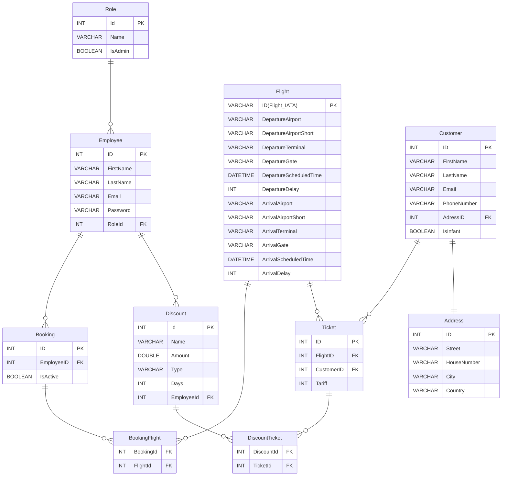

```mermaid
erDiagram
    Employee {
        INT ID PK
        VARCHAR FirstName
        VARCHAR LastName
        VARCHAR Email
        VARCHAR Password
        INT RoleId FK
    }

    Role {
        INT Id PK
        VARCHAR Name
        BOOLEAN IsAdmin
    }

    Discount {
        INT Id PK
        VARCHAR Name
        DOUBLE Amount
        VARCHAR Type
        INT Days
        INT EmployeeId FK
    }

    Booking {
        INT ID PK
        INT EmployeeID FK
        BOOLEAN IsActive
    }

    Flight {
        VARCHAR ID(Flight_IATA) PK
        VARCHAR DepartureAirport
        VARCHAR DepartureAirportShort
        VARCHAR DepartureTerminal
        VARCHAR DepartureGate
        DATETIME DepartureScheduledTime
        INT DepartureDelay
        VARCHAR ArrivalAirport
        VARCHAR ArrivalAirportShort
        VARCHAR ArrivalTerminal
        VARCHAR ArrivalGate
        DATETIME ArrivalScheduledTime
        INT ArrivalDelay
    }

    Ticket {
        INT ID PK
        INT FlightID FK
        INT CustomerID FK
        INT Tariff
    }

    Customer {
        INT ID PK
        VARCHAR FirstName
        VARCHAR LastName
        VARCHAR Email
        VARCHAR PhoneNumber
        INT AdressID FK
        BOOLEAN IsInfant
    }

    Address {
        INT ID PK
        VARCHAR Street
        VARCHAR HouseNumber
        VARCHAR City
        VARCHAR Country
    }

    BookingFlight {
        INT BookingId FK
        INT FlightId FK
    }

    DiscountTicket {
        INT DiscountId FK
        INT TicketId FK
    }

%% Relationships
    Role        ||--o{ Employee        : ""
    Employee    ||--o{ Booking         : ""
    Employee    ||--o{ Discount        : ""
    Booking     ||--o{ BookingFlight   : ""
    Flight      ||--o{ BookingFlight   : ""
    Flight      ||--o{ Ticket          : ""
    Customer    ||--o{ Ticket          : ""
    Customer    ||--|| Address          : ""
    Ticket      ||--o{ DiscountTicket  : ""
    Discount    ||--o{ DiscountTicket  : ""
```
