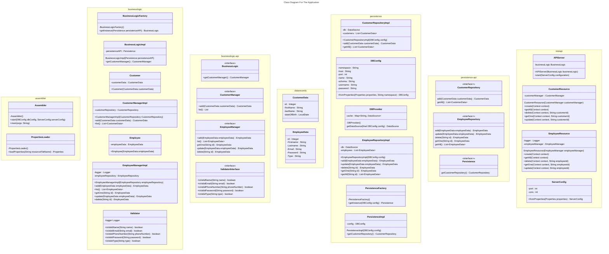

```mermaid
---
title: Class Diagram For The Application
---
classDiagram

namespace assembler {
    
    class Assembler{
        -Assembler()
        +start(DBConfig dbConfig, ServerConfig serverConfig)
        +main(args: String)
    }
    class PropertiesLoader{
        -PropertiesLoader()
        +loadProperties(String resourceFileName) Properties
    }
    
}

namespace businesslogic {
    
    class BusinessLogicFactory{
        -BusinessLogicFactory()
        +getInstance(Persistence persistenceAPI) BusinessLogic
    }
    class BusinessLogicImpl{
        -persistenceAPI : Persistence
        BusinessLogicImpl(Persistence persistenceAPI)
        +getCustomerManager() CustomerManager
    }
    class Customer{
        -customerData : CustomerData
        +Customer(CustomerData customerData)
    }
    class CustomerManagerImpl{
        -customerRepository : CustomerRepository
        +CustomerManagerImpl(CustomerRepository CustomerRepository)
        +add(CustomerData customerData) CustomerData
        +list() List~CustomerData~
        
    }
    class Employee{
        -employeeData : EmployeeData
        +Employee(EmployeeData employeeData)
        
    }
    class EmployeeManagerImpl{
        -logger : Logger
        -employeeRepository : EmployeeRepository
        +EmployeeManagerImpl(EmployeeRepository employeeRepository)
        +add(EmployeeData employeeData) EmployeeData
        +list() List~EmployeeData~
        +getOne(String id) EmployeeData
        +update(EmployeeData employeeData) EmployeeData
        +delete(String id) EmployeeData

    }
    class Validator{
        -logger Logger
        +isValidName(String name) boolean
        +isValidEmail(String email) boolean
        +isValidPhoneNumber(String phoneNumber) boolean
        +isValidPassword(String password) boolean
        +isValidType(String type) boolean
    }
    
}

namespace businesslogic-api {
    
    class BusinessLogic{
        <<interface>>
        +getCustomerManager() CustomerManager
    }
    class CustomerManager{
        <<interface>>
        +add(CustomerData customerData) CustomerData
        list() List<CustomerData>
    }
    class EmployeeManager{
        <<interface>>
        +add(EmployeeData employeeData) EmployeeData
        list() List~EmployeeData~
        getOne(String id) EmployeeData
        update(EmployeeData employeeData) EmployeeData
        delete(String id) EmployeeData
    }
    class ValidatorInterface{
        <<interface>>
        +isValidName(String name) boolean
        +isValidEmail(String email) boolean
        +isValidPhoneNumber(String phoneNumber) boolean
        +isValidPassword(String password) boolean
        +isValidType(String type) boolean
    }
    
}

namespace datarecords {
    
    class CustomerData{
        -id : Integer
        -firstName : String 
        -lastName : String
        -dateOfBirth : LocalDate
    }
    class EmployeeData{
        -id : Integer
        -Firstname : String
        -Lastname : String
        -Email : String
        -Password : String
        -Type : String
    }
}

namespace persistence {
    
    class CustomerRepositoryImpl{
        -db : DataSource
        -customers : List~CustomerData~
        +CustomerRepositoryImpl(DBConfig config)
        +add(CustomerData customerData) CustomerData
        +getAll() List~CustomerData~
        
    }
    class DBConfig{
        -namespace : String
        -host : String
        -port : int
        -name : String
        -schema : String
        -username : String
        -password : String
        +fromProperties(Properties properties, String namespace) DBConfig
    }
    class DBProvider{

        cache : Map~String, DataSource~
        -DBProvider()
        getDataSource(final DBConfig config) DataSource

    }
    class EmployeeRepositoryImpl{
        -db : DataSource
        -employees : List~EmployeeData~
        +EmployeeRepositoryImpl(DBConfig config)
        +add(EmployeeData employeeData) EmployeeData
        +update(EmployeeData employeeData) EmployeeData
        +delete(String id) EmployeeData
        +getOne(String id) EmployeeData
        +getAll(String id) List~EmployeeData~

    }
    class PersistenceFactory{
        -PersistenceFactory()
        +getInstance(DBConfig config) Persistence
    }
    class PersistenceImpl{
        -config : DBConfig
        PersistenceImpl(DBConfig config)
        +getCustomerRepository() CustomerRepository

    }
}

namespace persistence-api {
    class CustomerRepository{
        <<interface>>>
        add(CustomerData customerData) CustomerData
        getAll() List~CustomerData~
    }
    class EmployeeRepository{
        <<interface>>>
        add(EmployeeData employeeData) EmployeeData
        update(EmployeeData employeeData) EmployeeData
        delete(String id) EmployeeData
        getOne(String id) EmployeeData
        getAll() List~EmployeeData~
    }
    class Persistence{
        <<interface>>>
        getCustomerRepository() CustomerRepository
    }
}

namespace restapi {
    
    class APIServer{
        -businessLogic BusinessLogic
        +APIServer(BusinessLogic businessLogic)
        +start(ServerConfig configuration)
        
    }
    class CustomerResource{
        -customerManager : CustomerManager
        CustomerResource(CustomerManager customerManager)
        +create(Context context)
        +getAll(Context context)
        +delete(Context context, String customerId)
        +getOne(Context context, String customerId)
        +update(Context context, String customerId)
        
    }
    class EmployeeResource{
        -logger : Logger
        -employeeManager : EmployeeManager
        EmployeeResource(EmployeeManager employeeManager)
        +create(Context context)
        +getAll(Context context)
        +delete(Context context, String employeeId)
        +getOne(Context context, String employeeId)
        +update(Context context, String employeeId)

    }
    class ServerConfig{
        -port : int
        -cors : int
        +fromProperties(Properties properties) ServerConfig
    }
}

```