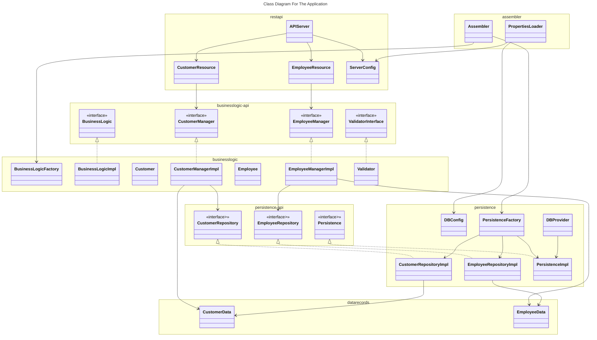

```mermaid
---
title: Class Diagram For The Application
---
classDiagram

namespace assembler {
    
    class Assembler{
    }
    class PropertiesLoader{
    }
    
}

namespace businesslogic {
    
    class BusinessLogicFactory{
    }
    class BusinessLogicImpl{
    }
    class Customer{
    }
    class CustomerManagerImpl{
    }
    class Employee{
    }
    class EmployeeManagerImpl{
    }
    class Validator{
    }
    
}

namespace businesslogic-api {
    
    class BusinessLogic{
        <<interface>>
    }
    class CustomerManager{
        <<interface>>
    }
    class EmployeeManager{
        <<interface>>
    }
    class ValidatorInterface{
        <<interface>>
    }
    
}

namespace datarecords {
    
    class CustomerData{
    }
    class EmployeeData{
    }
}

namespace persistence {
    
    class CustomerRepositoryImpl{
    }
    class DBConfig{
    }
    class DBProvider{
    }
    class EmployeeRepositoryImpl{
    }
    class PersistenceFactory{
    }
    class PersistenceImpl{
    }
}

namespace persistence-api {
    class CustomerRepository{
        <<interface>>>
    }
    class EmployeeRepository{
        <<interface>>>
    }
    class Persistence{
        <<interface>>>
    }
}

namespace restapi {
    
    class APIServer{
    }
    class CustomerResource{
    }
    class EmployeeResource{
    }
    class ServerConfig{
    }
}

%% Implementations of Interfaces
    BusinessLogic <|.. BusinessLogicImpl
    CustomerManager <|.. CustomerManagerImpl
    EmployeeManager <|.. EmployeeManagerImpl
    ValidatorInterface <|.. Validator
    CustomerRepository <|.. CustomerRepositoryImpl
    EmployeeRepository <|.. EmployeeRepositoryImpl
    Persistence <|.. PersistenceImpl

%% Dependencies and Data Relationships
    CustomerManagerImpl --> CustomerRepository
    EmployeeManagerImpl --> EmployeeRepository
    CustomerManagerImpl --> CustomerData
    EmployeeManagerImpl --> EmployeeData
    CustomerRepositoryImpl --> CustomerData
    EmployeeRepositoryImpl --> EmployeeData

%% Persistence Layer Relationships
    PersistenceFactory --> PersistenceImpl
    PersistenceFactory --> CustomerRepositoryImpl
    PersistenceFactory --> EmployeeRepositoryImpl
    DBProvider --> PersistenceImpl

%% REST API Dependencies
    APIServer --> ServerConfig
    APIServer --> CustomerResource
    APIServer --> EmployeeResource
    CustomerResource --> CustomerManager
    EmployeeResource --> EmployeeManager

%% Assembler and Configuration Dependencies
    Assembler --> BusinessLogicFactory
    Assembler --> PersistenceFactory
    PropertiesLoader --> DBConfig
    PropertiesLoader --> ServerConfig
```