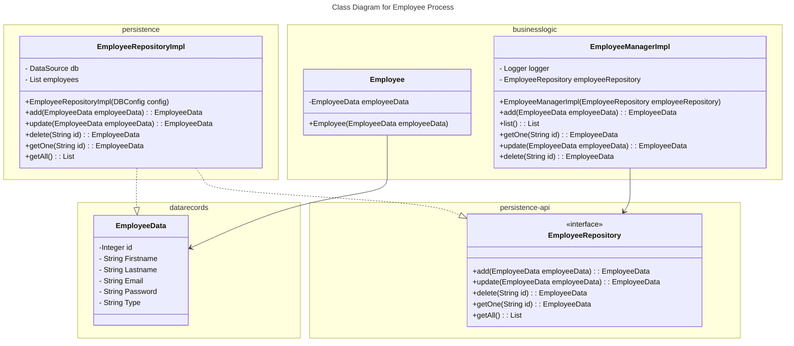

```mermaid
---
title: Class Diagram for Employee Process
---
classDiagram
    
    namespace datarecords {
        class EmployeeData {
            -Integer id
            - String Firstname
            - String Lastname
            - String Email
            - String Password
            - String Type
        }
    }
    
    namespace businesslogic {
        class Employee {
            -EmployeeData employeeData
            +Employee(EmployeeData employeeData)
        }
        class EmployeeManagerImpl {
            - Logger logger
            - EmployeeRepository employeeRepository
            +EmployeeManagerImpl(EmployeeRepository employeeRepository)
            +add(EmployeeData employeeData): EmployeeData
            +list(): List<EmployeeData>
            +getOne(String id): EmployeeData
            +update(EmployeeData employeeData): EmployeeData
            +delete(String id): EmployeeData
        }
    }

    namespace persistence-api {
        class EmployeeRepository {
            <<interface>>
            +add(EmployeeData employeeData): EmployeeData
            +update(EmployeeData employeeData): EmployeeData
            +delete(String id): EmployeeData
            +getOne(String id): EmployeeData
            +getAll(): List<EmployeeData>
        }
    }

    namespace persistence {
        class EmployeeRepositoryImpl {
            - DataSource db
            - List<EmployeeData> employees
            +EmployeeRepositoryImpl(DBConfig config)
            +add(EmployeeData employeeData): EmployeeData
            +update(EmployeeData employeeData): EmployeeData
            +delete(String id): EmployeeData
            +getOne(String id): EmployeeData
            +getAll(): List<EmployeeData>
        }
    }

    EmployeeManagerImpl --> EmployeeRepository
    EmployeeRepositoryImpl ..|> EmployeeRepository
    EmployeeRepositoryImpl ..|> EmployeeData
    Employee --> EmployeeData

```
