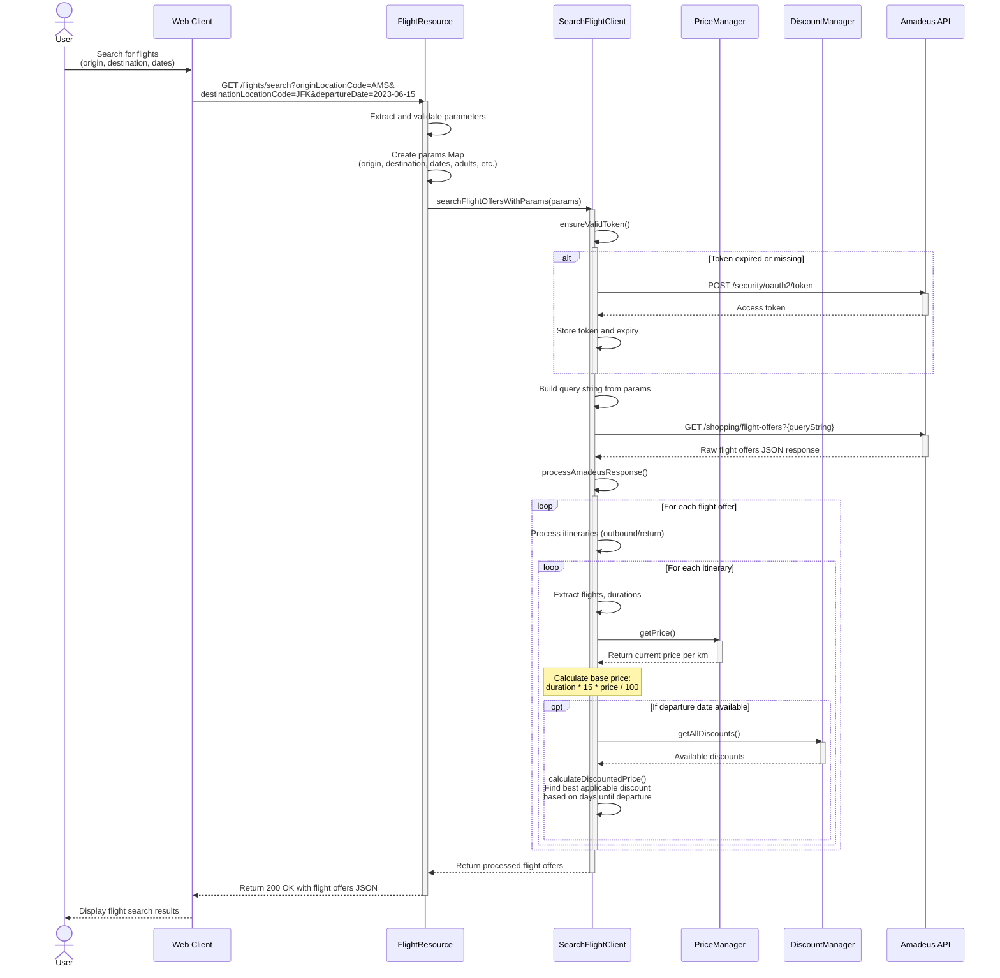

**# Flight Search - Sequence Diagram**

The following sequence diagram illustrates the process of searching for flights using the SearchFlightClient.

This diagram illustrates the complete flow for searching flights:

1. The User initiates a flight search via the Web Client, providing origin, destination, and dates
2. The Web Client sends a GET request to the `/flights/search` endpoint with query parameters
3. The FlightResource controller:
   - Extracts and validates the required parameters
   - Creates a parameter map for the search
   - Calls the SearchFlightClient to perform the search
4. The SearchFlightClient:
   - Ensures it has a valid authentication token
   - Builds a query string from the parameters
   - Calls the Amadeus API to search for flight offers
   - Processes the response to extract relevant information
   - For each flight, calculates prices based on duration using the PriceManager
   - Applies discounts if applicable using the DiscountManager
   - Returns the processed results to the controller
5. The FlightResource returns the search results to the Web Client
6. The Web Client displays the results to the User

The diagram shows how the system integrates with the external Amadeus API while applying internal pricing and discount rules to the search results. 
