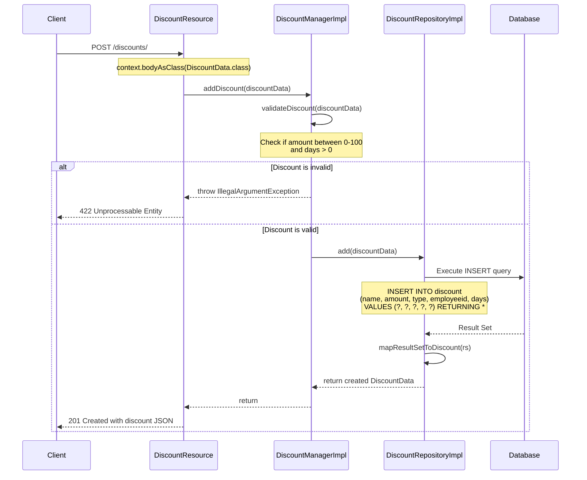

```mermaid
sequenceDiagram
    participant Client
    participant DiscountResource
    participant DiscountManagerImpl
    participant DiscountRepositoryImpl
    participant Database

    Client->>DiscountResource: POST /discounts/
    Note over DiscountResource: context.bodyAsClass(DiscountData.class)

    DiscountResource->>DiscountManagerImpl: addDiscount(discountData)

    DiscountManagerImpl->>DiscountManagerImpl: validateDiscount(discountData)
    Note over DiscountManagerImpl: Check if amount between 0-100<br>and days > 0

    alt Discount is invalid
        DiscountManagerImpl-->>DiscountResource: throw IllegalArgumentException
        DiscountResource-->>Client: 422 Unprocessable Entity
    else Discount is valid
        DiscountManagerImpl->>DiscountRepositoryImpl: add(discountData)

        DiscountRepositoryImpl->>Database: Execute INSERT query
        Note over DiscountRepositoryImpl: INSERT INTO discount<br>(name, amount, type, employeeid, days)<br>VALUES (?, ?, ?, ?, ?) RETURNING *

        Database-->>DiscountRepositoryImpl: Result Set

        DiscountRepositoryImpl->>DiscountRepositoryImpl: mapResultSetToDiscount(rs)
        DiscountRepositoryImpl-->>DiscountManagerImpl: return created DiscountData

        DiscountManagerImpl-->>DiscountResource: return
        DiscountResource-->>Client: 201 Created with discount JSON
    end
```