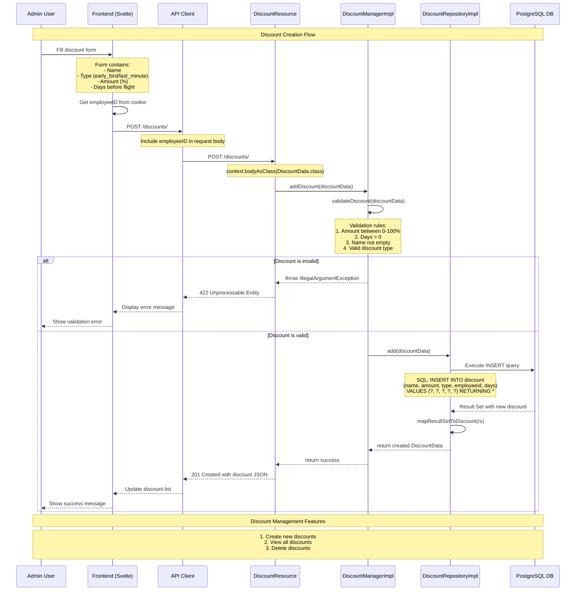

```mermaid
sequenceDiagram
    participant Admin as Admin User
    participant Frontend as Frontend (Svelte)
    participant API as API Client
    participant Backend as DiscountResource
    participant Manager as DiscountManagerImpl
    participant Repo as DiscountRepositoryImpl
    participant DB as PostgreSQL DB

    Note over Admin,DB: Discount Creation Flow
    Admin->>Frontend: Fill discount form
    Note over Frontend: Form contains:<br>- Name<br>- Type (early_bird/last_minute)<br>- Amount (%)<br>- Days before flight

    Frontend->>Frontend: Get employeeID from cookie
    Frontend->>API: POST /discounts/
    Note over API: Include employeeID in request body

    API->>Backend: POST /discounts/
    Note over Backend: context.bodyAsClass(DiscountData.class)

    Backend->>Manager: addDiscount(discountData)

    Manager->>Manager: validateDiscount(discountData)
    Note over Manager: Validation rules:<br>1. Amount between 0-100%<br>2. Days > 0<br>3. Name not empty<br>4. Valid discount type

    alt Discount is invalid
        Manager-->>Backend: throw IllegalArgumentException
        Backend-->>API: 422 Unprocessable Entity
        API-->>Frontend: Display error message
        Frontend-->>Admin: Show validation error
    else Discount is valid
        Manager->>Repo: add(discountData)

        Repo->>DB: Execute INSERT query
        Note over Repo: SQL: INSERT INTO discount<br>(name, amount, type, employeeid, days)<br>VALUES (?, ?, ?, ?, ?) RETURNING *

        DB-->>Repo: Result Set with new discount

        Repo->>Repo: mapResultSetToDiscount(rs)
        Repo-->>Manager: return created DiscountData

        Manager-->>Backend: return success
        Backend-->>API: 201 Created with discount JSON
        API-->>Frontend: Update discount list
        Frontend-->>Admin: Show success message
    end

    Note over Admin,DB: Discount Management Features
    Note over Admin,DB: 1. Create new discounts<br>2. View all discounts<br>3. Delete discounts<br>
```