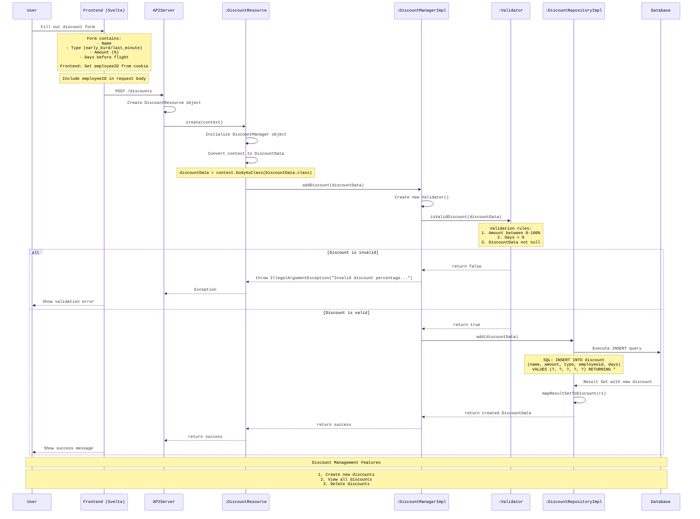

```mermaid
sequenceDiagram
%%{init: {"fontFamily": "monospace"}}%%
    participant User as User
    participant Frontend as Frontend (Svelte)
    participant Server as APIServer
    participant Resource as :DiscountResource
    participant Manager as :DiscountManagerImpl
    participant Validator as :Validator
    participant Repo as :DiscountRepositoryImpl
    participant DB as Database

    User->>Frontend: Fill out discount form

    Note over Frontend: Form contains:<br>- Name<br>- Type (early_bird/last_minute)<br>- Amount (%)<br>- Days before flight<br><br>Frontend: Get employeeID from cookie
    Note over Frontend: Include employeeID in request body
    
    Frontend->>Server: POST /discounts
    
    Server->>Server: Create DiscountResource object
    Server->>Resource: create(context)
    
    Resource->>Resource: Initialize DiscountManager object
    Resource->>Resource: Convert context to DiscountData
    Note over Resource: discountData = context.bodyAsClass(DiscountData.class)
    
    Resource->>Manager: addDiscount(discountData)

    Manager->>Manager: Create new Validator()
    Manager->>Validator: isValidDiscount(discountData)
    Note over Validator: Validation rules:<br>1. Amount between 0-100%<br>2. Days > 0<br>3. DiscountData not null

    alt Discount is invalid
        Validator-->>Manager: return false
        Manager-->>Resource: throw IllegalArgumentException("Invalid discount percentage...")
        Resource-->>Server: Exception
        Frontend-->>User: Show validation error
    else Discount is valid
        Validator-->>Manager: return true
        Manager->>Repo: add(discountData)

        Repo->>DB: Execute INSERT query
        Note over Repo: SQL: INSERT INTO discount<br>(name, amount, type, employeeid, days)<br>VALUES (?, ?, ?, ?, ?) RETURNING *

        DB-->>Repo: Result Set with new discount

        Repo->>Repo: mapResultSetToDiscount(rs)
        Repo-->>Manager: return created DiscountData

        Manager-->>Resource: return success
        Resource-->>Server: return success
        Frontend-->>User: Show success message
    end

    Note over User,DB: Discount Management Features
    Note over User,DB: 1. Create new discounts<br>2. View all discounts<br>3. Delete discounts
```