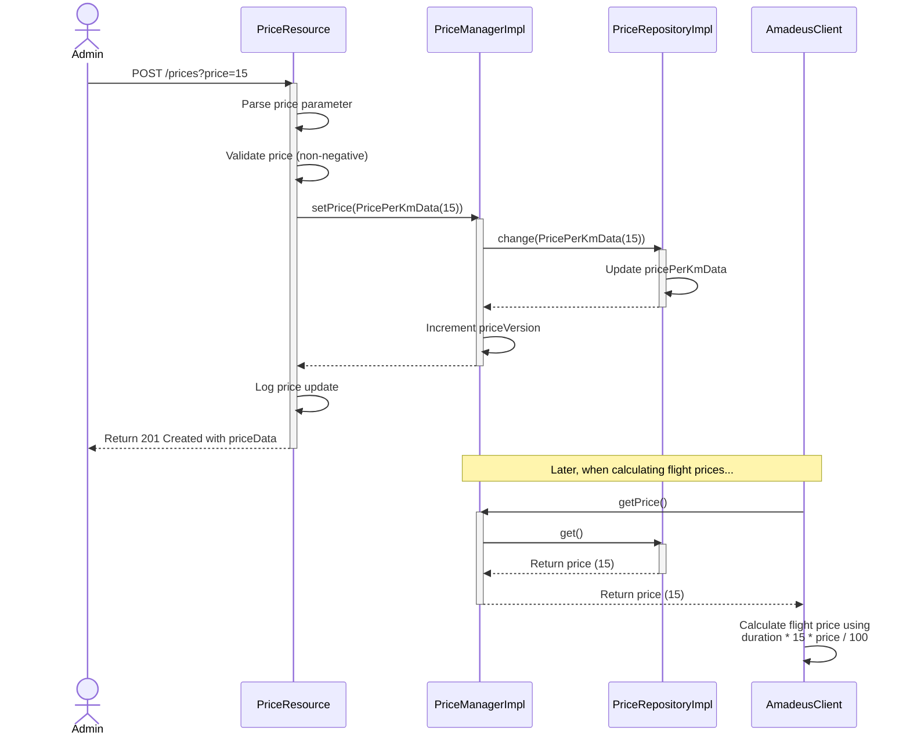

**# Discount System - Sequence Diagram**

The following sequence diagram illustrates how discounts are applied to flight prices in the system.

This diagram shows the flow for setting and using the price per km:

1. An Admin sends a POST request to `/prices` with a price parameter
2. The PriceResource handles the request, parses and validates the price
3. The PriceResource calls setPrice() on the PriceManager with a new PricePerKmData
4. The PriceManagerImpl updates the price in the PriceRepository and increments its version
5. The PriceRepositoryImpl stores the new price value
6. A success response is returned to the Admin

Later, when calculating flight prices:
1. The AmadeusClient calls getPrice() on the PriceManager
2. The PriceManagerImpl retrieves the current price from the PriceRepository
3. The AmadeusClient uses the price to calculate the flight cost using the formula: duration * 15 * price / 100 
