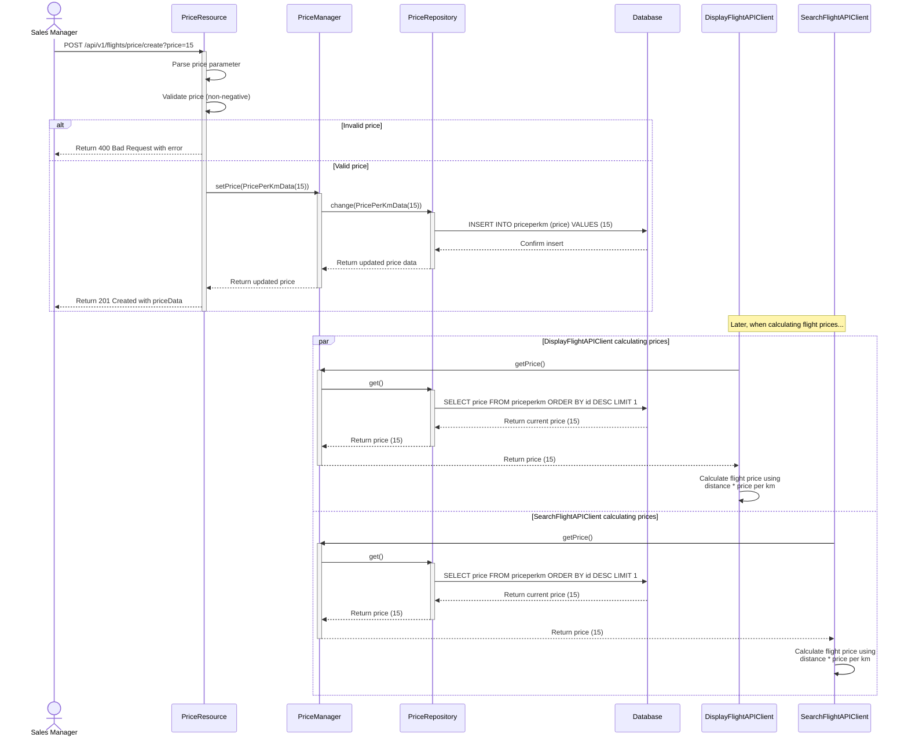

# Set Price Per Kilometer - Sequence Diagram

The following sequence diagram shows how the price per kilometer is set in the system.

This diagram shows the flow for setting and using the price per km:

1. A Sales Manager sends a POST request to `/prices` with a price parameter
2. The PriceResource handles the request, parses and validates the price
3. The PriceResource calls setPrice() on the PriceManager with a new PricePerKmData
4. The PriceManagerImpl updates the price in the PriceRepository
5. The PriceRepositoryImpl stores the new price value in the database
6. A success response is returned to the Sales Manager

Later, when calculating flight prices:
1. The SearchFlightAPIClient calls getPrice() on the PriceManager
2. The PriceManagerImpl retrieves the current price from the PriceRepository
3. The PriceRepositoryImpl gets the most recent price from the database
4. The SearchFlightAPIClient uses the price to calculate the flight cost using the formula: duration * 15 * price / 100 
